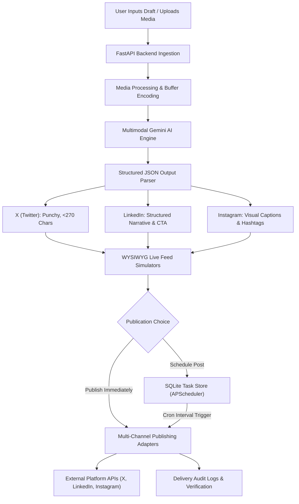
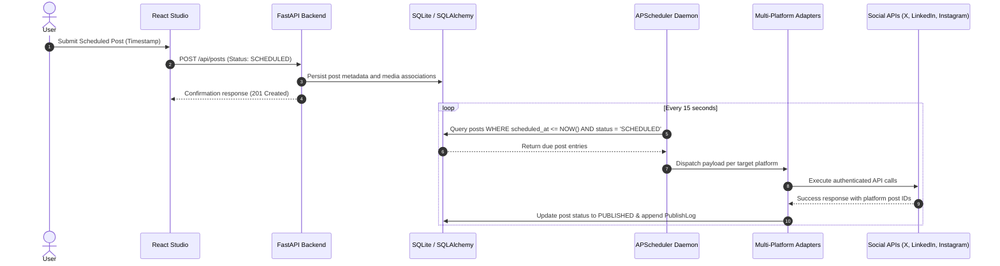

# Social Pulse Studio

An automated, multimodal AI-powered social media generation, adaptation, and multi-channel distribution platform.

[](https://github.com/BloodyPrince7/Media-Automation/releases/tag/v1.0.0)
[](https://media-automation-backend.onrender.com/api/health)
[](https://media-automation-henna.vercel.app)
[](LICENSE)

---

## Executive Summary

Social Pulse Studio (Pulse) automates the end-to-end lifecycle of multi-platform social media publishing. Modern social distribution requires tailoring messaging to the unique audience, length, and media expectations of each platform. Pulse eliminates manual cross-posting overhead by accepting single draft notes or uploaded imagery, intelligently transforming them into platform-native formats using Google Gemini multimodal AI, providing real-time feed simulation, and dispatching content across connected channels via background scheduling engines.

---

## Video Demonstration & Tutorial

A comprehensive end-to-end video demonstration showcasing authentication, multimodal content generation, side-by-side feed simulation, and scheduled multi-channel distribution is available below:

- **Video Walkthrough**: [Watch Video Tutorial](https://drive.google.com/file/d/100GefzrEMFF6Zn666BXaMrvx5o5-vq9P/view?usp=sharing)

---

## Deployments and Interfaces

- **Production Web Application**: [https://media-automation-henna.vercel.app](https://media-automation-henna.vercel.app)
- **Production API Service**: [https://media-automation-backend.onrender.com](https://media-automation-backend.onrender.com)
- **Interactive OpenAPI Documentation (Swagger UI)**: [https://media-automation-backend.onrender.com/docs](https://media-automation-backend.onrender.com/docs)
- **Service Health Check**: [https://media-automation-backend.onrender.com/api/health](https://media-automation-backend.onrender.com/api/health)

---

## System Architecture & Workflows

### 1. End-to-End Content Adaptation and Publishing Pipeline



### 2. Multimodal AI Adaptation Workflow

1. **Ingestion and Normalization**: Accepts draft text accompanied by up to 4 multipart media files (JPEG/PNG). Binary payloads are read into memory and mapped to multimodal data parts.
2. **Context & Persona Framing**: Prompts define strict copywriting criteria tailored to each network (e.g., character boundaries, paragraph spacing, hashtag grouping, engagement triggers).
3. **Structured Schema Enforcement**: Model responses are bound to strict JSON schema definitions via `response_mime_type="application/json"`.
4. **Resilient Cascading Architecture**: The system prioritizes low-latency Gemini 3.5 Flash-Lite, cascades to Gemini 3.8 Flash upon load thresholds, and falls back to a deterministic local rule engine if external services are unreachable.

### 3. Background Scheduling and Execution Workflow



---

## Core Capabilities

### Multi-Channel Distribution & Live Simulators
- **X (Twitter)**: Tweepy v2 post management and v1.1 chunked media upload integration with 280-character boundary tracking and live feed simulation.
- **LinkedIn**: REST Posts API (`POST /rest/posts`) with formatted long-form layout previews and engagement simulation.
- **Instagram**: Meta Graph API integration with aspect-ratio enforcement, carousel indicators, and caption rendering.
- **Omni-Channel Mode**: Single-source authoring with simultaneous side-by-side verification and channel-specific adjustments.

### Multimodal Artificial Intelligence
- **Google Gemini Integration**: Dual-tier multimodal integration utilizing Gemini 3.5 Flash-Lite and Gemini 3.8 Flash via the official `google-genai` SDK.
- **Visual Context Extraction**: Analyzes uploaded visual assets alongside raw text to derive contextually grounded captions.
- **Embedded Strategic Advisor**: Integrated assistant providing structured copywriting frameworks (AIDA), hook ideation, and posting timing recommendations.

### Enterprise Data Management & Security
- **Authentication**: PBKDF2 HMAC SHA-256 password hashing with 16-byte cryptographically secure random salts and 100,000 iterations.
- **Auditing & Logging**: Comprehensive transaction logs tracking platform post identifiers, HTTP delivery statuses, error traces, and publication timestamps.
- **Persistent Storage**: Normalized relational schema managed via SQLAlchemy ORM and SQLite.

---

## Repository Structure

```
.
├── backend/
│   ├── app/
│   │   ├── config.py              # Environment configuration & credentials
│   │   ├── database.py            # SQLite database engine & session maker
│   │   ├── models.py              # SQLAlchemy models (User, Post, PublishLog, AppSetting)
│   │   ├── schemas.py             # Pydantic validation schemas
│   │   ├── auth.py                # PBKDF2 hashing & session token management
│   │   ├── scheduler.py           # APScheduler background worker daemon
│   │   ├── ai_service.py          # Multimodal Google Gemini pipeline
│   │   ├── publishers/            # Multi-channel publishing adapters
│   │   │   ├── base.py
│   │   │   ├── twitter_publisher.py
│   │   │   ├── linkedin_publisher.py
│   │   │   ├── instagram_publisher.py
│   │   │   └── mock_publisher.py
│   │   └── main.py                # FastAPI endpoints & CORS middleware
│   ├── uploads/                   # Uploaded media assets
│   ├── requirements.txt           # Python backend dependencies
│   └── run.py                     # Local development runner
├── frontend/
│   ├── src/
│   │   ├── api/client.js          # Axios API client with dynamic backend resolution
│   │   ├── components/            # UI Components
│   │   │   ├── AuthScreen.jsx     # Gated authentication screen
│   │   │   ├── Composer.jsx       # Studio post composer & platform switcher
│   │   │   ├── XPreview.jsx       # Twitter live simulator
│   │   │   ├── LinkedInPreview.jsx# LinkedIn live simulator
│   │   │   ├── InstagramPreview.jsx # Instagram live simulator
│   │   │   ├── ScheduledQueue.jsx # Queue manager
│   │   │   ├── PostHistory.jsx    # Delivery logs with live links
│   │   │   ├── AnalyticsDashboard.jsx # Statistics & audience metrics
│   │   │   ├── MediaAdvisorBot.jsx # AI Growth Advisor bot
│   │   │   └── FloatingObjectsStage.jsx # Interactive presentation stage
│   │   ├── App.jsx                # Root application
│   │   └── index.css              # Styling & typography
│   ├── vercel.json                # Vercel proxy configuration
│   └── vite.config.js             # Vite bundler configuration
├── render.yaml                    # Render Blueprint deployment definition
└── README.md
```

---

## Local Development Setup

### 1. Prerequisites
- Python 3.10+
- Node.js 18+ and npm
- Valid Google Gemini API Key

### 2. Backend Setup
```bash
cd backend
python -m venv .venv

# On Windows:
.\.venv\Scripts\activate

# On Linux/macOS:
source .venv/bin/activate

pip install -r requirements.txt
python run.py
```
Backend API service initializes at `http://127.0.0.1:8080`. API documentation is accessible at `http://127.0.0.1:8080/docs`.

### 3. Frontend Setup
```bash
cd frontend
npm install
npm run dev
```
Frontend development server initializes at `http://localhost:5173`.

---

## License

This project is licensed under the MIT License - see the [LICENSE](LICENSE) file for details.
